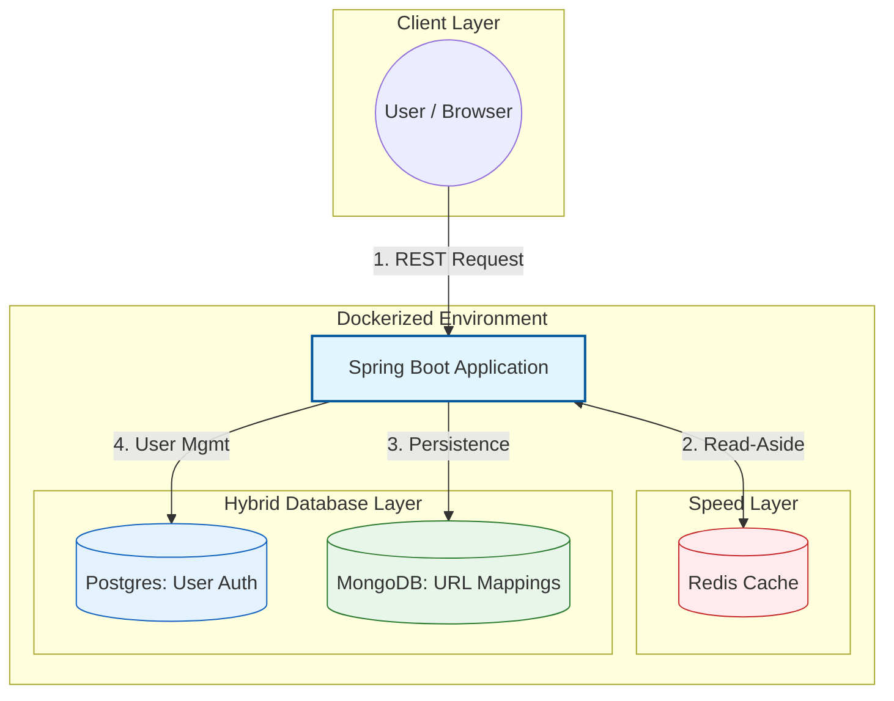

# 🔗 TinyURL Scalable Microservice


A robust, full-stack URL shortening service designed for high performance, scalability, and ease of deployment. This project demonstrates a microservices-ready architecture using **Spring Boot**, containerized with **Docker**, and utilizes a **Hybrid Database** approach (SQL + NoSQL) alongside **Read-Aside Caching** for optimal performance.

## 🏗 System Architecture

The system is designed to handle high read traffic (redirections) vs. write traffic (shortening) efficiently.


## 🚀 Quick Start
```
docker-compose up --build
```
Service will be available at: http://localhost:8080.

## 🛠 Tech Stack
* **Backend:** Java 21, Spring Boot 3.2.3.
* **NoSQL:** MongoDB (Scalable URL storage).
* **SQL:** PostgreSQL (User management).
* **Cache:** Redis (Read-Aside strategy).
* **DevOps:** Docker & Docker Compose.

